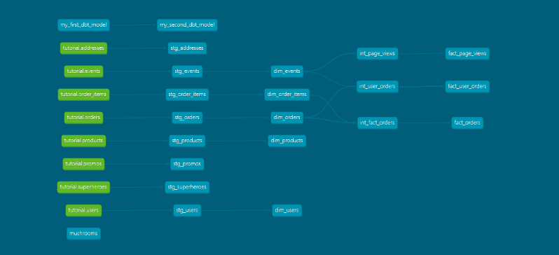

### Week 2 Project questions:
- What is our user repeat rate? 99/124=.798 or about 80%
(Repeat Rate = Users who purchased 2 or more times / users who purchased)

    >with user_order as (  
        select user_id,count(*) as order_count from dbt_stephanie_m.stg_orders    
        group by user_id   
    )
    select count(ui3.user_id) from user_order ui3 where ui3.order_count >= 2;  (99)

    >with user_order as (  
        select user_id,count(*) as order_count from dbt_stephanie_m.stg_orders    
        group by user_id   
    )
    select count(ui3.user_id) from user_order ui3 where ui3.order_count >= 1; (124)

- What are good indicators of a user who will likely purchase again?

    >Good indicators would be users that have purchased several times (or maybe at least twice) and have given good reviews if questioned about the site. Time browsing on the site may be a good indicator, or at least they are thinking about it.

- What about indicators of users who are likely NOT to purchase again? If you had more data, what features would you want to look into to answer this question?

    >Users that browsed but have never purchased, or have spent less than one minute on the site are not likely to make a purchase. Users that never received their packages (lost) will probably not order again, or if their order took too long to get to them. You might want to find out why a user did not spend more time browsing the website, so you could add a survey at the end of a session to rate the website--perhaps they had trouble navigating the site or could not find their product.

- Explain the marts models you added. Why did you organize the models in the way you did?

    >For the core mart, I created my dimension tables there which were pretty much the same as the stg_xxxx tables. I added an intermediate model int_fact_orders which for each user_id, added a field for the first and last order dates, and another field for the number of items in that order.Then the fact_orders table, just had a flag/indicator (Y/N) whether that order was the first or last order. This allowed for a bit more clarity in the fact model and simplified the logic. I also added a core.yml with descriptions and tests of just the core models.

    >For the marketing mart, I added an intermediate table int_user_orders with the date the order shipped and the date it was delievered. This was so the fact_user_orders table could be just a summary table with number of total order delivered, total dollar amount spent on all orders, average spent over all orders, the average time between checkout and order shipped for all of these user's orders, and average time from shipped to received for each user. I also added a marketing.yml with descriptions and tests of just the marketing models.

    >For the product mart, I concentrated on the events model to learn how long each user spent doing each event on the website. I created an intermediate model int_page_views which calculates the start and stop times of each event per order per session  so I guess the granularity is by event/session. Some entries will have null stop times if there was only one event for that session or it was the last event for that session, the stop time being the start time of the next event in that session (there seems to be no logoff event_type). Then for my fact_page_views table, I will aggregate this data over multiple sessions to answer the question: for each order and event_type, how long was the user in each event_type? The problem with this might be that I will only have stop times for those events that had 'next event' happen in that session. Also, the order_id is not created until the user does 'checkout' so I had to backfill the order_id in my intermediate table. I also added a product.yml with descriptions and tests of just the product models.

### Week 2 DAG
S

- What assumptions are you making about each model? (i.e. why are you adding each test?)

    >I'm assuming that the users have to login and create an account with a user_id to get any kind of data about their orders. I'm assuming that there is one or no 'checkout' event per order_id as well as 'shipped' event (no multiple packages). 

- Did you find any “bad” data as you added and ran tests on your models? How did you go about either cleaning the data in the dbt model or adjusting your assumptions/tests?

    >Yes, in the events model data, the order_id was null except for 'checkout' and 'shipped' events, so I had to update the intermediate model and backfill this order_id field
    
- Your stakeholders at Greenery want to understand the state of the data each day. Explain how you would ensure these tests are passing regularly and how you would alert stakeholders about bad data getting through.

    >I guess I would run the model daily and run the 'dbt test' daily through some sort of scheduled job. The output could go to a file and if the word 'fail' appears in any part of the file, then I could send a slack message to a slack channel.
