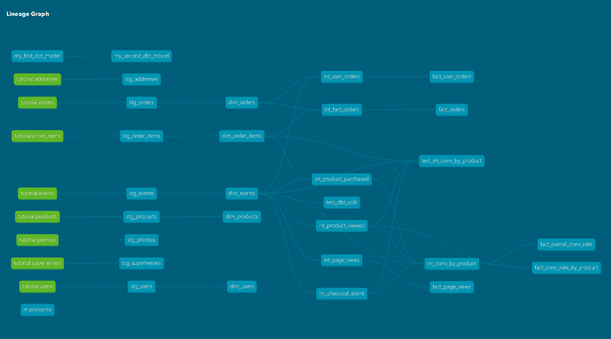

### Week 3 Project questions:

## Part 1:
- What is our overall conversion rate? 361/578 = 0.62456747404844290657 %
(NOTE: conversion rate is defined as the # of unique sessions with a purchase event / total number of unique sessions.)

- What is our conversion rate by product?
(Conversion rate by product is defined as the # of unique sessions with a purchase event of that product / total number of unique sessions that viewed that product)

      product_id                         ################ conversion rate
    05df0866-1a66-41d8-9ed7-e2bbcddd6a3d ################ 0.45000000000000000000

    35550082-a52d-4301-8f06-05b30f6f3616 ################ 0.48888888888888888889

    37e0062f-bd15-4c3e-b272-558a86d90598 ################ 0.46774193548387096774 

    4cda01b9-62e2-46c5-830f-b7f262a58fb1 ################ 0.34426229508196721311

    55c6a062-5f4a-4a8b-a8e5-05ea5e6715a3 ################ 0.48387096774193548387

    579f4cd0-1f45-49d2-af55-9ab2b72c3b35 ################ 0.51851851851851851852

    58b575f2-2192-4a53-9d21-df9a0c14fc25 ################  0.39344262295081967213

    5b50b820-1d0a-4231-9422-75e7f6b0cecf ################  0.47457627118644067797

    5ceddd13-cf00-481f-9285-8340ab95d06d ################ 0.49253731343283582090

    615695d3-8ffd-4850-bcf7-944cf6d3685b ################  0.49230769230769230769

    64d39754-03e4-4fa0-b1ea-5f4293315f67 ################ 0.47457627118644067797

    689fb64e-a4a2-45c5-b9f2-480c2155624d ################ 0.53731343283582089552

    6f3a3072-a24d-4d11-9cef-25b0b5f8a4af ################ 0.41176470588235294118

    74aeb414-e3dd-4e8a-beef-0fa45225214d ################ 0.55555555555555555556

    80eda933-749d-4fc6-91d5-613d29eb126f ################ 0.41891891891891891892

    843b6553-dc6a-4fc4-bceb-02cd39af0168 ################ 0.42647058823529411765

    a88a23ef-679c-4743-b151-dc7722040d8c ################ 0.47826086956521739130

    b66a7143-c18a-43bb-b5dc-06bb5d1d3160 ################ 0.53968253968253968254

    b86ae24b-6f59-47e8-8adc-b17d88cbd367 ################ 0.50943396226415094340

    bb19d194-e1bd-4358-819e-cd1f1b401c0c ################ 0.42307692307692307692

    be49171b-9f72-4fc9-bf7a-9a52e259836b ################ 0.51020408163265306122

    c17e63f7-0d28-4a95-8248-b01ea354840e ################ 0.54545454545454545455

    c7050c3b-a898-424d-8d98-ab0aaad7bef4 ################ 0.45333333333333333333

    d3e228db-8ca5-42ad-bb0a-2148e876cc59 ################ 0.46428571428571428571

    e18f33a6-b89a-4fbc-82ad-ccba5bb261cc ################ 0.40000000000000000000

    e2e78dfc-f25c-4fec-a002-8e280d61a2f2 ################ 0.41269841269841269841

    e5ee99b6-519f-4218-8b41-62f48f59f700 ################ 0.40909090909090909091

    e706ab70-b396-4d30-a6b2-a1ccf3625b52 ################ 0.50000000000000000000

    e8b6528e-a830-4d03-a027-473b411c7f02 ################ 0.39726027397260273973

    fb0e8be7-5ac4-4a76-a1fa-2cc4bf0b2d80 ################ 0.60937500000000000000

## Part 2:
I created two macros: 
decimal_division--checks for zero denominator,and then casts both numerator and denominator as decimal
max_checkout_time--Finds the maximum checkout time for a session for any product taking session_id and product_id as arguments

I created a macros.yml file describing the macros.

## Part 3:
I modified the dbt_project.yml file with the usage access 'on-run-end:' for my schema.

## Part 4:
I installed the dbt_utils package and used the dbt_utils.get_column_values macro to get the counts of each type of event in the event table. I'm not sure if this simplified my project at all, but I learned a lot about using this macro to do similar lines of code without coding it by hand.

## Part 5:

### Week 3 DAG

I added my macros and a dbt_utils call into the models  test_dbt_utils.sql and test_int_conv_by_product.sql in the mart/core folder. I kept the old models in so I could do a comparison with the upgraded models (int_conv_by_product--old). The test_dbt_utils.sql model was just a test and really didn't integrate with the other models, but I couldn't find one that would work for me, as my models were all pretty simple to start out with. I expected the test_int_conv_by_product model to simplify a bit, but it actually added one more connection, so I'm not sure what happened there! I think it should have dropped the connection to the int_product_purchased model but it didn't :(  I will have to look at that one later. 

S

